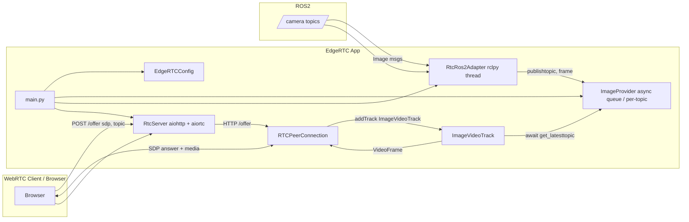

# edge-rtc
This repo is for using WebRTC with ROS2


## Description
This project aims to integrate WebRTC capabilities into ROS2 applications, enabling real-time communication and data exchange. Specifically for video streaming and low latency application with Robotic Perception SOTA models.

## Block Diagram


## Demo


https://github.com/user-attachments/assets/0e80663d-384c-43a8-868e-afb1480116e5

## Architecture



## Installation

```bash
virtualenv edgertc_env
source edgertc_env/bin/activate
pip install -r edge_rtc/requirements.txt

export PYTHONPATH=$PYTHONPATH:/<path_to_venv>/edgertc_env/lib/python3.*/site-packages

colcon build --symlink-install --packages-select edge_rtc
source install/setup.bash

ros2 launch edge_rtc webrtc_video_server.launch.py

ros2 launch edge_rtc webrtc_ros2_client.launch.py
```

## References
- [WebRTC ROS](https://github.com/RobotWebTools/webrtc_ros)
- [aiortc](https://github.com/aiortc/aiortc)
- [WebRTC ROS2 Streamer](https://github.com/nicolecll/webrtc_ros2_streamer)
